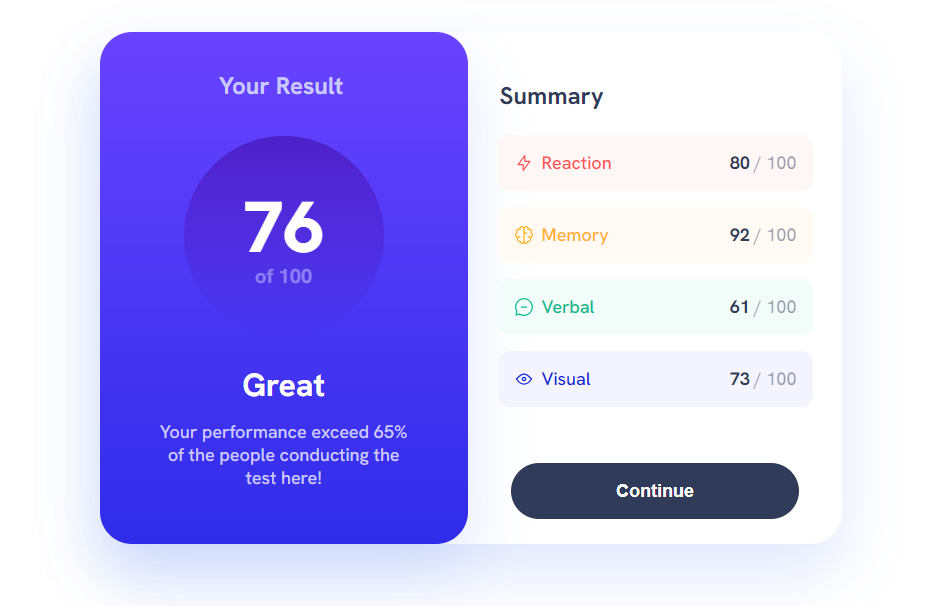
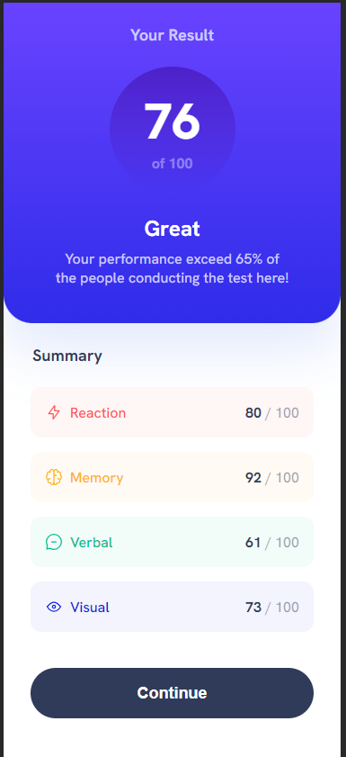

# Frontend Mentor - Results Summary Component

This project marks my second venture on Frontend Mentor, tackling the Results Summary Component. The main goal was to faithfully replicate the provided design while incorporating Sass, a technology I am currently learning. Please note that this project remains static, and I did not implement the bonus dynamic JSON data or JavaScript functionality.

## Project Screenshot




## Project Overview

The challenge focused on creating a results summary component, providing a static display of information without utilizing dynamic JSON data. Users can experience the optimal layout based on their device's screen size, and all interactive elements feature hover and focus states.

## Tools and Technologies

- HTML
- Sass (for styling)
- VS Code

## Project Setup

1. **Clone the Repository:**

   ```bash
   git clone https://github.com/your-username/your-repository.git
   ```

2. **Navigate to Project Directory:**

   ```bash
   cd your-repository
   ```

3. **Open in Browser:**
   - Launch the `index.html` file in your preferred browser.

4. **Or open in your browser**
   - [ResultsSummaryComponent](https://matpawluk.github.io/ResultsSummaryComponent/)

## Interactive Elements

- Hover and focus states have been implemented for all interactive elements, adhering to the project's specified requirements.

## Support and Community

If you encounter any issues or have questions about the challenge, consider joining the Frontend Mentor community. Seek assistance in the help channel, where fellow developers can offer support.

[Frontend Mentor Community](https://www.frontendmentor.io/community)

## Acknowledgments

I extend my appreciation to Frontend Mentor for presenting this challenging project. It has significantly contributed to honing my frontend development skills, especially in the realm of Sass.

Happy coding! 🚀✨
